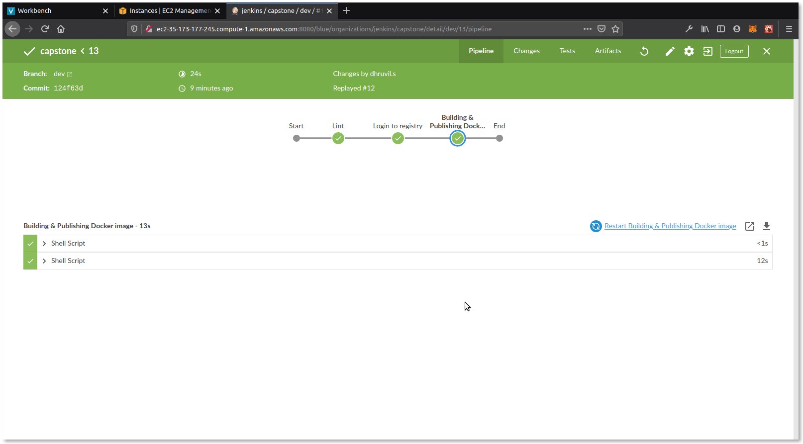

# CAPSTONE

This is a capstone project made by me for submission to the cloud dev ops nano-degree by Udacity. It shows the following skills:
* [x] Containerizing an application
* [x] Use of Jenkins for CI/CD
* [x] Jenkins and automated linting, building docker images, pushing to private repositories
* [x] Jenkins and blue-green pipelinedeployment on EKS(AWS Elastic Kubernetes Service).

URL: [Link to application(Please note that this may not be active)](http://a66285216370e4353b14f1d14383e3ba-1589166266.us-east-1.elb.amazonaws.com:8000/)

## Structure

This repository has 2 branches:
* master (green)
* dev (blue)

In each branch the following files remain almost same:
- index.html - The main application file to be served via nginx
- Dockerfile - The docker file to containerize the application
- Makefile - setup file to ease up the process of setup lint and build
- run_docker.sh - Script file which contains compiled commands to build and run a docker application from dockerfile
- run_kubernetes.sh - Script file which contains compiled commands to run an application in kubernetes cluster
    >>> NOTE: YOU NEED TO HAVE CLUSTERS AND CLUSTER MANAGERS SETUP WITH THE `.kube/config` FILE CORRECTLY CONFIGURED AS WELL TO RUN `run_kubernetes.sh` SUCCESSFULLY.
- Jenkinsfile - Target file for jenkins server
- *controller.json - It defines the replica controller for the kuberenetes cluster along with the images it should rely on for running containers
- blue-green-lb.json - Sets the load balancer to point to "branch" application

## Screenshots

* Initial lint fail(green branch): 
* Lint pass(blue branch): 
* Pipeline build success: 
* Blue App: 
* Green App: 